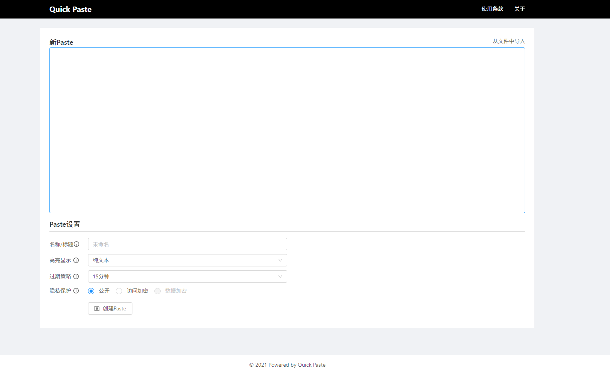
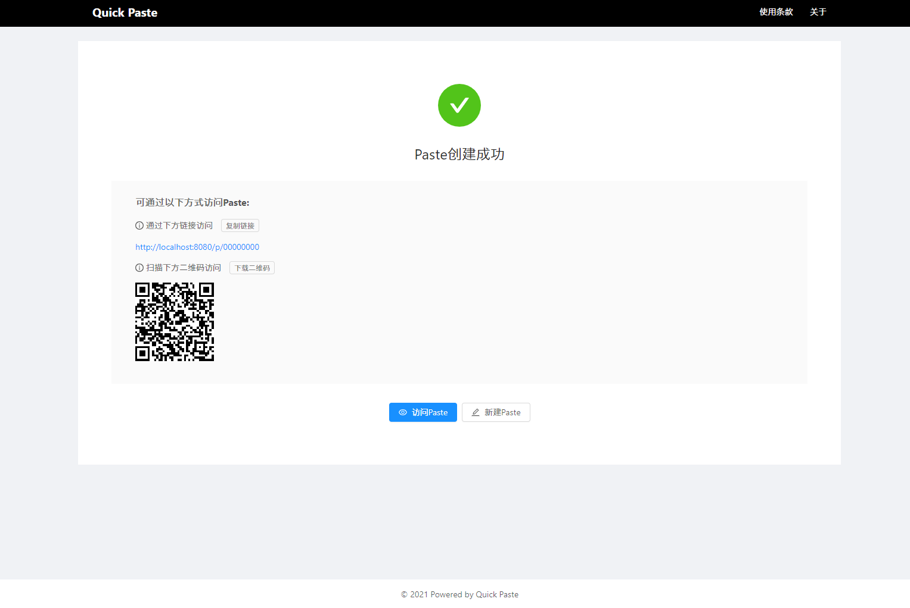
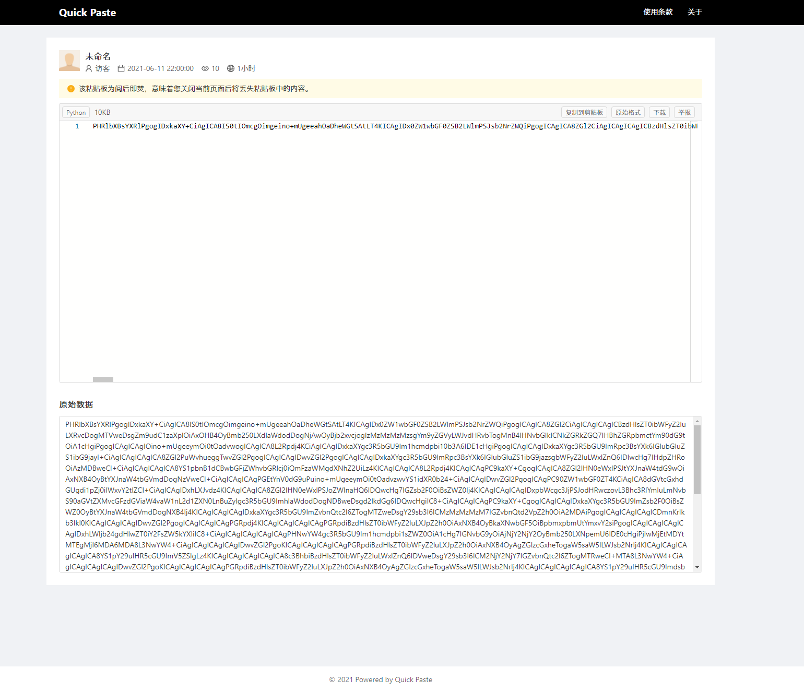
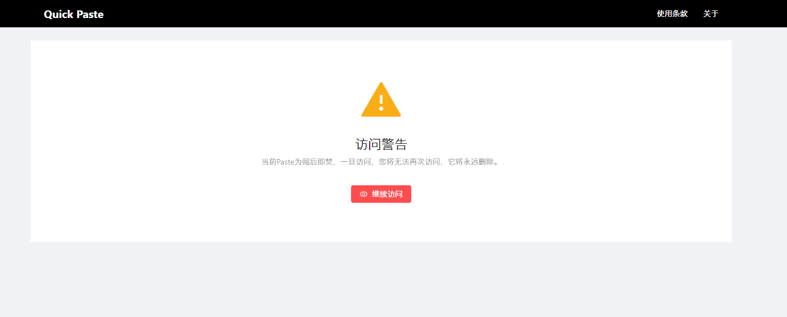
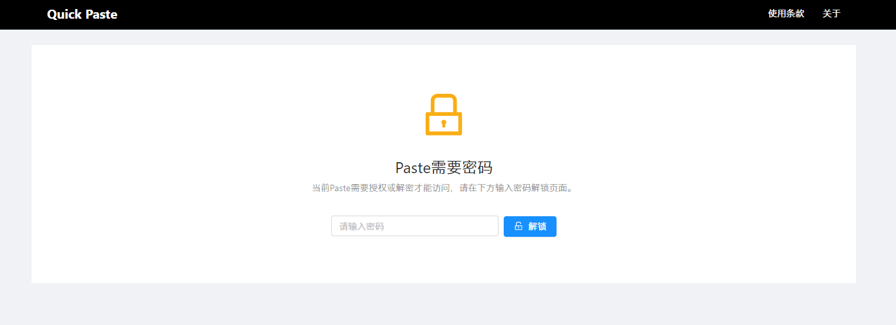
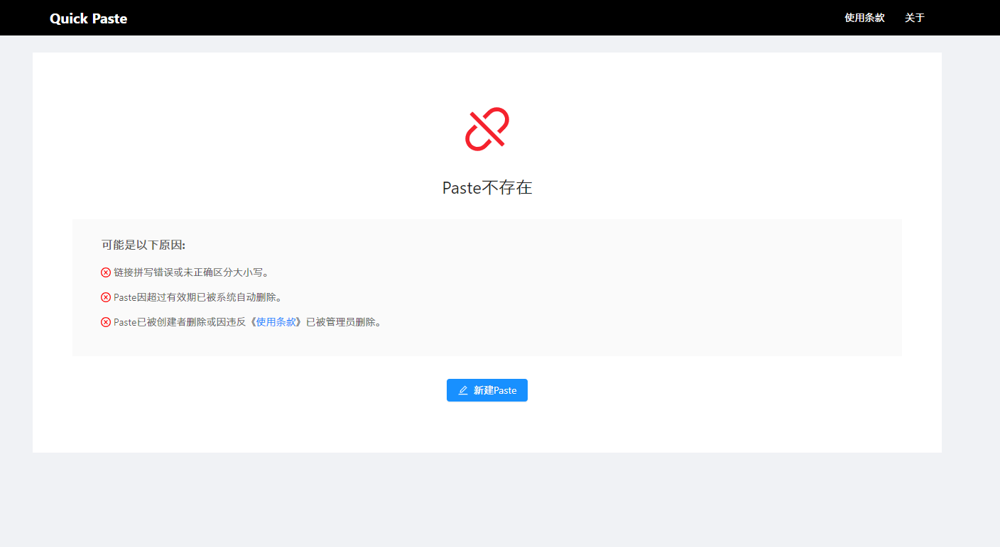

# Quick Paste （正在开发中）

[](https://github.com/RichardLitt/standard-readme)


[Quick Paste](https://github.com/banto6/quick-paste)是一款代码或文本分享和托管平台，支持访问权限管理和定时删除，更加保护您的隐私安全。


## 内容列表

- [特性](#特性)
- [截图](#截图)
- [使用说明](#使用说明)
  - [Docker](#Docker)
- [维护者](#维护者)
- [如何贡献](#如何贡献)
- [使用许可](#使用许可)

## 特性

- 可设置Paste失效时间
- 代码高亮
- 访问保护
- 数据离线加密

## 截图



<details>
  <summary>点击查看更多截图</summary>










</details>

## 使用说明

### Docker部署

```sh
docker run -d --name quick-paste -p 80:80 xxxx/xxx:xxx
```

## 维护者

[@banto6](https://github.com/banto6)

## 如何贡献

非常欢迎你的加入！[提一个 Issue](https://github.com/banto6/quick-paste/issues/new) 或者提交一个 Pull Request。


## 使用许可

[GNU General Public License v2.0](LICENSE)
